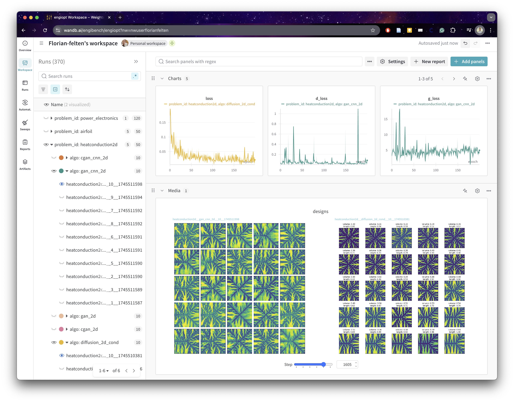

[](https://arxiv.org/abs/2508.00831)
[](https://pre-commit.com/)
[](
    https://github.com/astral-sh/ruff)
[](http://mypy-lang.org/)
[](https://colab.research.google.com/github/IDEALLab/EngiOpt/blob/main/example_easy_model.ipynb)

# EngiOpt

This repository contains the code for optimization and machine learning algorithms for engineering design problems. Our goal here is to provide clean example usage of [EngiBench](https://github.com/IDEALLab/EngiBench) and provide strong baselines for future comparisons.

## Coding Philosophy
As much as we can, we follow the [CleanRL](https://github.com/vwxyzjn/cleanrl) philosophy: single-file, high-quality implementations with research-friendly features:
* Single-file implementation: every training detail is in one file, so you can easily understand and modify the code. Evaluation is not per-model — every model is scored by one shared evaluator through the `Generator` contract in `adapter.py`, so a metric is added once rather than thirteen times.
* High-quality: we use type hints, docstrings, and comments to make the code easy to understand. We also rely on linters for formatting and checking our code.
* Logging: we use experiment tracking tools like [Weights & Biases](https://wandb.ai/site) to log the results of our experiments. All our "official" runs are logged in the [EngiOpt project](https://wandb.ai/engibench/engiopt).
* Reproducibility: we seed all the random number generators, make PyTorch deterministic, report the hyperparameters and code in WandB.

## Implemented algorithms


**Algorithm** | **Class** | **Dimensions** | **Conditional?** | **Model**
--- | --- | --- | --- | ---
[cgan_1d](engiopt/generators/cgan_1d/) | Inverse Design | 1D | ✅ | GAN MLP
[cgan_2d](engiopt/generators/cgan_2d/) | Inverse Design | 2D | ✅ | GAN MLP
[cgan_bezier](engiopt/generators/cgan_bezier/) | Inverse Design | 1D | ✅ | GAN + Bezier layer
[cgan_cnn_2d](engiopt/generators/cgan_cnn_2d/) | Inverse Design | 2D | ✅ | GAN + CNN
[cgan_cnn_3d](engiopt/generators/cgan_cnn_3d/) | Inverse Design | 3D | ✅ | GAN + 3D CNN
[cgan_vae](engiopt/generators/cgan_vae/) | Inverse Design | 3D | ✅ | MultiView GAN + VAE
[diffusion_1d](engiopt/generators/diffusion_1d/) | Inverse Design | 1D | ❌ | Diffusion
[diffusion_2d_cond](engiopt/generators/diffusion_2d_cond/) | Inverse Design | 2D | ✅ | Diffusion
[gan_1d](engiopt/generators/gan_1d/) | Inverse Design | 1D | ❌ | GAN MLP
[gan_2d](engiopt/generators/gan_2d/) | Inverse Design | 2D | ❌ | GAN MLP
[gan_bezier](engiopt/generators/gan_bezier/) | Inverse Design | 1D | ❌ | GAN + Bezier layer
[gan_cnn_2d](engiopt/generators/gan_cnn_2d/) | Inverse Design | 2D | ❌ | GAN + CNN
[surrogate_model](engiopt/surrogate_model/) | Surrogate Model | 1D | ❌ | MLP
[vqgan](engiopt/generators/vqgan) | Inverse Design | 2D | ✅ | VQVAE + Transformer
[pixel_cnn_pp_2d](engiopt/generators/pixel_cnn_pp_2d) | Inverse Design | 2D | ✅ | PixelCNN++ Autoregressive Model

Every algorithm above is registered, meaning this repository holds an adapter that
can rebuild it. Being *evaluable* additionally needs published weights, and the two
are not the same: `cgan_cnn_2d`, `diffusion_2d_cond`, `gan_cnn_2d`, and `vqgan` have
checkpoints on HuggingFace, and the rest must be trained before they can be scored.
The `Dimensions` column is the other half of the answer — a 1D or 3D generator has no
`beams2d` checkpoint because it cannot serve a 2D problem at all, not because one is
missing. For the live answer rather than this snapshot:

```
python -m engiopt.evaluate --problem-id beams2d --list-generators --check-availability
```

Historical W&B-era checkpoints are **not** being migrated; see
[docs/checkpoint_layout.md](docs/checkpoint_layout.md#historical-checkpoints).

## Dashboards
HuggingFace hosts everything that has to be reloaded or compared -- model weights, run configs, evaluation metrics, and the leaderboard. WandB hosts what you only look at: loss curves and sample images. Nothing in the evaluation path requires WandB, so training with `--track false` produces exactly the same checkpoints and scores. You can access some of our runs at https://wandb.ai/engibench/engiopt.



## Install
Install EngiOpt dependencies:
```
cd EngiOpt/
pip install -e .
```

You might want to install a specific PyTorch version, e.g., with CUDA on top of it, see [PyTorch install](https://pytorch.org/get-started/locally/).

**Evaluation needs EngiBench from source.** The committed evaluation specs are frozen
against the current EngiBench, whose `photonics2d` and `thermoelastic2d` read the `v1`
datasets; the newest PyPI release (0.2.0) still points those two at `v0`. Installing
EngiBench from PyPI therefore draws different conditions, and the specs report a clear
mismatch rather than scoring against the wrong data:
```
git clone git@github.com:IDEALLab/EngiBench.git
cd EngiBench/
pip install -e ".[all]"
```
This is also what CI installs, pinned to a commit. Training is unaffected.

## Running the code

First, if you want to use weights and biases, you need to set the `WANDB_API_KEY` environment variable. You can get your API key from [wandb](https://wandb.ai/site). Then, you can run:
```
wandb login
```

If you want to save or load checkpoints from Hugging Face Hub, make sure your environment is authenticated there as well:
```
huggingface-cli login
```

### Inverse design
Each generator provides its own training script and adapter; evaluation is handled through the shared `python -m engiopt.evaluate` command.

To train a model, you can run (for example):

```
python engiopt/generators/cgan_cnn_2d/cgan_cnn_2d.py --problem-id "beams2d" --track --wandb-entity None --save-model --n-epochs 200 --seed 1
```

This trains a CGAN 2D w/ CNN on `beams2d`. The flags mirror W&B's: `--track` enables W&B logging, `--wandb-entity`/`--wandb-project` say where the run goes, `--save-model` uploads the checkpoint to HuggingFace, and `--hf-entity`/`--hf-repo-prefix` say where the checkpoint goes.

W&B holds media, scalars, and run history. HuggingFace holds the model weights. One log-in per service:

```
wandb login              # for tracking
huggingface-cli login    # for checkpoints (or: export HF_TOKEN=...)
```

The defaults (`--hf-entity IDEALLab --hf-repo-prefix engiopt`) push to `huggingface.co/IDEALLab/engiopt-cgan-cnn-2d/beams2d/cfg_<fingerprint>/seed_1/`, one location per hyperparameter configuration. A run using the script's default hyperparameters additionally claims `beams2d/seed_1/`, which is what the bare model name resolves to. The W&B run summary records the HF path for traceability. Each checkpoint package contains the model files plus `run_config.json` and `metadata.json`, so evaluation needs no live W&B state.

For reproducible debugging runs, you can additionally enable strict deterministic mode:
```
python engiopt/generators/cgan_cnn_2d/cgan_cnn_2d.py --problem-id "beams2d" --seed 1 --strict-determinism
```

For new cGAN density-field runs, you can emit designs natively in the EngiBench `[0, 1]` density range while preserving older `tanh` checkpoint behavior by default:
```
python engiopt/generators/cgan_cnn_2d/cgan_cnn_2d.py --problem-id "beams2d" --generator-output-activation sigmoid
```

Then evaluate:
```
python -m engiopt.evaluate --problem-id "beams2d" --generators cgan_cnn_2d --seeds 1 2 3 \
    --config-fingerprints cgan_cnn_2d:825831f6
```
Evaluation pulls the checkpoint from HF automatically. Pass `--hf-entity` / `--hf-repo-prefix` to point at a different HF repo, and `--config-fingerprints` to score specific hyperparameter configurations instead of the default one.

The fingerprint is needed here rather than optional. A bare `--seeds 1` resolves the **canonical** package, `{problem_id}/seed_1`, which only a run using the training script's default hyperparameters writes — and a hyperparameter sweep never writes one, because every arm varies something. `IDEALLab/engiopt-cgan-cnn-2d` currently holds 46 beams2d packages and no canonical path, so a bare `--seeds 1` there fails and lists what the repo does hold. `diffusion_2d_cond` and `vqgan` do have canonical packages and can be evaluated by seed alone:

```
python -m engiopt.evaluate --problem-id beams2d --generators diffusion_2d_cond --seeds 1 2 3
```

To give a swept arm the canonical path without retraining it:

```
python -m engiopt.promote_checkpoint --algo cgan_cnn_2d --problem-id beams2d --list
python -m engiopt.promote_checkpoint --algo cgan_cnn_2d --problem-id beams2d --seed 1 --config-fingerprint 825831f6
```

`825831f6` is the one cgan_cnn_2d configuration trained on seeds 1–10; the rest of the sweep is seed 42 only, so promoting any other arm to `seed_1` would name a package that does not exist.

### Leaderboard

Results are rows in a CSV, keyed by problem, algorithm, config fingerprint, seed, and spec version. Locally that CSV is `--output-csv`; published, it is the same table in a HuggingFace dataset repo:

```
python -m engiopt.evaluate --problem-id beams2d --generators cgan_cnn_2d --seeds 1 2 3 \
    --config-fingerprints cgan_cnn_2d:825831f6 \
    --push-to IDEALLab/engiopt-leaderboard
```

Publishing downloads the existing board, merges on the row key, and uploads the result conditional on the revision it read, so adding one model never recomputes or overwrites anyone else's rows. Ranks restart at 1 within each `(problem_id, spec_version)` — a beams2d score and a photonics2d score measure different things and are never placed in one ordering. `--skip-existing` skips rows the board already holds for the exact weights, compared by `checkpoint_hash`.

Every row records what produced it: **which repo, path, revision, and content hash** the weights came from, the EngiOpt version, and the EngiBench version that ran the evaluation. The spec records what it was frozen against, including the pinned dataset revision, so a change to either side is visible rather than silently shifting every number.

**Contributors with write access to the leaderboard repository may publish provisional rows; external self-service submission is tracked in #78. Nothing is ranked until it is re-run.** Rows land `verified=false`, and a runner re-fetches the checkpoint at its recorded revision and scores it itself before they enter the ranking:

```
python -m engiopt.verify --board IDEALLab/engiopt-leaderboard            # audit; writes nothing
python -m engiopt.verify --board ... --verifier ideallab-ci --publish    # the official runner
```

Because the row carries the full address, that audit is not privileged — anyone can run the same command and get the same answer.

**Two integrity metrics decide whether a score means what it looks like.** The evaluation protocol is public, so a lookup table keyed on the condition vector returns the dataset-optimal designs and posts a perfect `mmd` and a zero `viol` — measured on beams2d, it beats a trained cGAN on every headline metric. `novelty` / `copy_rate` catch it (`copy_rate=1.00`), and `cond_sens` catches a model that ignores the conditions it claims to use. Both are diagnostic rather than ranked, because ranking on them would just reward the opposite extreme. Flagged rows are published and left out of the ordering.

See **[LEADERBOARD.md](LEADERBOARD.md)** for the submission path, the flags, and what would actually close the copying hole.

### Surrogate model

The current surrogate model comprises several steps:
- hyperparameter tuning,
- training a (ensemble) model,
- optimization, and
- evaluation.

See this [notebook](https://github.com/IDEALLab/EngiOpt/blob/main/engiopt/surrogate_model/case_study_pe_notebook.ipynb) for an example.

Surrogate-model optimization paths now use the same checkpoint abstraction. For example, the power-electronics optimizer can consume:
* HF package refs such as `hf://IDEALLab/engiopt-mlp-tabular-only/power_electronics/DcGain/seed_42`
* local checkpoint package directories

HuggingFace is the only checkpoint backend. W&B artifacts are no longer a model source anywhere in the codebase; see [docs/checkpoint_layout.md](docs/checkpoint_layout.md) for the package layout.


## Colab notebooks
We have some colab notebooks that show how to use some of the EngiBench/EngiOpt features.
* [Example easy model (GAN)](https://colab.research.google.com/github/IDEALLab/EngiOpt/blob/main/example_easy_model.ipynb)
* [Example hard model (Diffusion)](https://colab.research.google.com/github/IDEALLab/EngiOpt/blob/main/example_hard_model.ipynb)


## Citing

If you use EngiBenc/EngiOpt in your research, please cite the following paper:

```bibtex
@misc{felten_engibench_2025,
	title = {{EngiBench}: {A} {Framework} for {Data}-{Driven} {Engineering} {Design} {Research}},
	url = {http://arxiv.org/abs/2508.00831},
	doi = {10.48550/arXiv.2508.00831},
	urldate = {2025-08-07},
	publisher = {arXiv},
	author = {Felten, Florian and Apaza, Gabriel and B\¨aunlich, Gerhard and Diniz, Cashen and Dong, Xuliang and Drake, Arthur and Habibi, Milad and Hoffman, Nathaniel J. and Keeler, Matthew and Massoudi, Soheyl and VanGessel, Francis G. and Fuge, Mark},
	month = jun,
	year = {2025},
}
```
